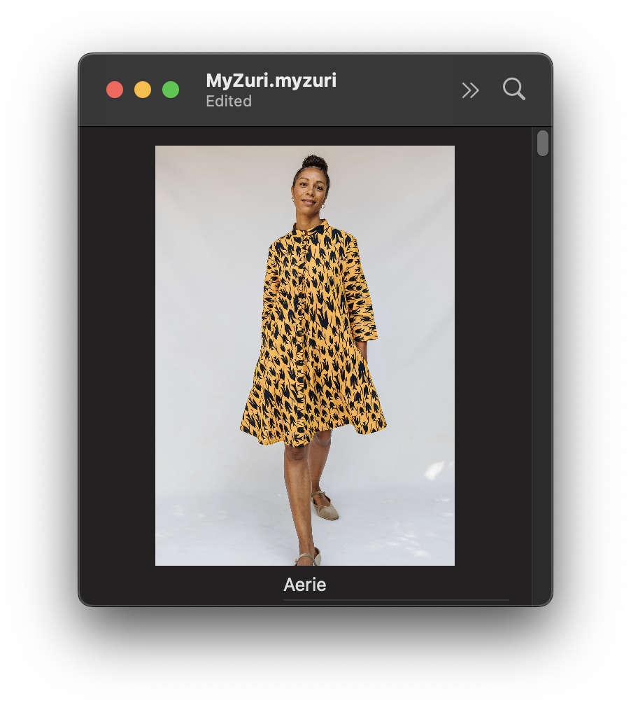

# MyZuri

* SwiftUI
* SwiftData
* Document-based app

Right now, it's functionally one table, as I haven't added support for the second table (`ItemColor`) yet or made more than a basic functioning UI.

## TODO

1. Add `Item` support for the colors.
2. Add UI for editing colors.
3. Change the main view to have separate sections based on wishlist vs. purchased items.
